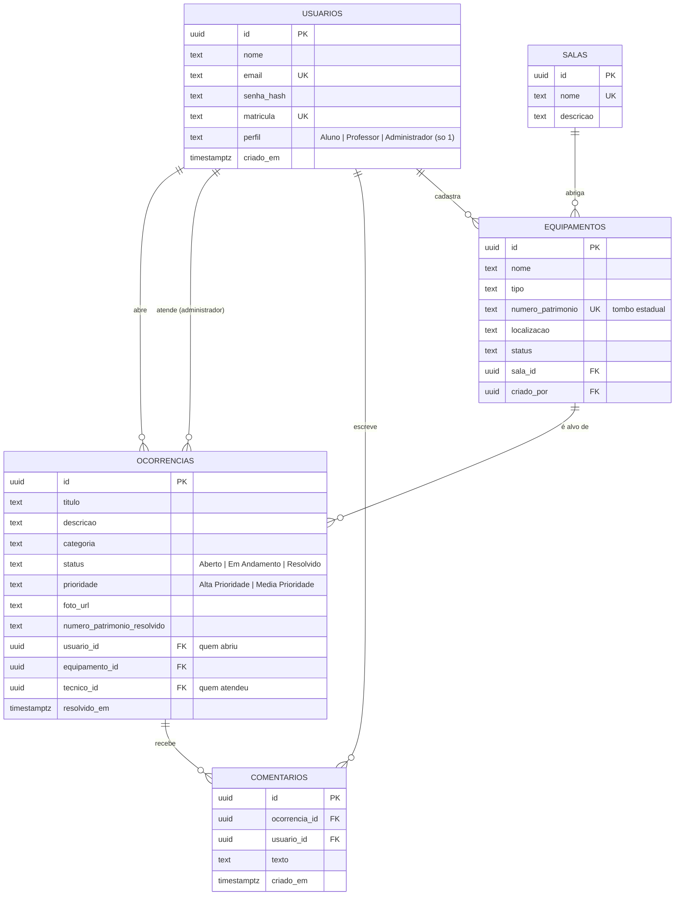

# DER — Diagrama Entidade-Relacionamento (Sprint 1)

O GitHub desenha o diagrama abaixo automaticamente. Para a entrega, você também pode tirar um print em
**Supabase → Database → Schema Visualizer**.

